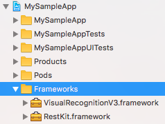
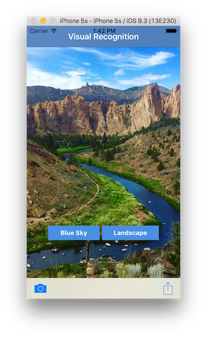
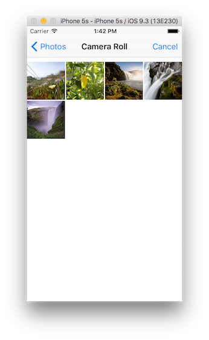
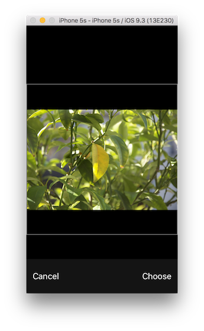
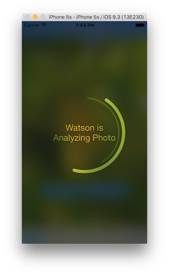
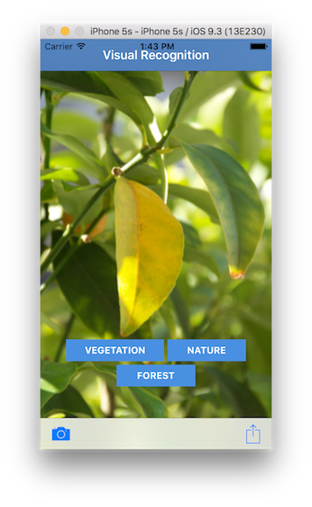

## Visual Recognition
Bluemix Mobile Starter for Visual Recognition in Swift

[](https://bluemix.net)
[](https://developer.apple.com/swift/)

### Table of Contents
* [Summary](#summary)
* [Requirements](#requirements)
* [Configuration](#configuration)
* [Run](#run)
* [License](#license)

### Summary
This Bluemix Mobile Starter will showcase the Visual Recognition service from Watson and give you integration points for each of the Bluemix Mobile services.

### Requirements
* iOS 8.0+
* Xcode 8
* Swift 3.0

### Configuration
* [Bluemix Mobile services Dependency Mangagement](#bluemix-mobile-services-dependency-management)
* [Watson Dependency Management](#watson-dependency-management)
* [Watson Credential Mangement](#watson-credential-mangement)

#### Bluemix Mobile services Dependency Management
The Bluemix Mobile services SDK uses [CocoaPods](https://cocoapods.org/) to manage and configure dependencies. To use our latest SDKs you need version 1.1.0.rc.2.

You can install CocoaPods using the following command:

```bash
$ sudo gem install cocoapods --pre
```

If the CocoaPods repository is not confifgured, run the following command:

```bash
$ pod setup
```

For this starter, a pre-configured `Podfile` has been included in the **(projectrootdirectory)/Podfile** location. To download and install the required dependencies, run the following command in the **(projectrootdirectory)**:

```bash
$ pod install
```
Now Open the Xcode workspace: `{APP_Name}.xcworkspace`. From now on, open the `.xcworkspace` file becuase it contains all the dependencies and configurations.

If you run into any issues during the pod install, it is recommended to run a pod update by using the following commands:

```bash
$ pod update
$ pod install
```

> [View configuration](#configuration)

#### Watson Dependency Management
This starter uses the Watson Developer Cloud iOS SDK in order to use the Watson Visual Recognition service.

The Watson Developer Cloud iOS SDK uses [Carthage](https://github.com/Carthage/Carthage) to manage dependencies and build binary frameworks.

You can install Carthage with [Homebrew](http://brew.sh/):

```bash
$ brew update
$ brew install carthage
```

To use the Watson Developer Cloud iOS SDK in any of your applications, specify it in your `Cartfile`:

```
github "watson-developer-cloud/ios-sdk"
```

For this starter, a pre-configured `Cartfile` has been included in the **(projectrootdirectory)/Cartfile** location

Run the following command to build the dependencies and frameworks:

```bash
$ carthage update --platform iOS
```

> **Note**: You may have to run `carthage update --platform iOS --no-use-binaries`, if the binary is a lower version than your current version of Swift.

Once the build has completed, the frameworks can be found in the **(projectrootdirectory)/Carthage/Build/iOS/** folder. The Xcode project in this starter already includes framework links to the following frameworks in this directory:

* **VisualRecognitionV3.framework**
* **RestKit.framework**



If you build your Carthage frameworks in a separate folder, you will have to drag-and-drop the above frameworks into your project and link them in order to run this starter successfully.

> [View configuration](#configuration)

#### Watson Credential Management
Once the dependencies have been built and configured for the Bluemix Mobile service SDKs as well as the Watson Developer Cloud SDK, no more actions are needed! The unique credentials to your Bluemix Visual Recognition service have been injected into the application during generation.

> [View configuration](#configuration)

### Run
You can now run the application on a simulator or physical device:








The application allows you to do Visual Recognition for images from your Photo Library or from an image you take using your device's camera (physical device only). Take a photo using your device's camera or choose a photo from your library using the toolbar buttons on the bottom of the application. Once an image is chosen, the Watson Visual Recognition service will analyze the photo and create tags for the photo. You can click the tags to see a percentage value which shows how confident Watson is. For an image with a face present, Watson will attempt to show a gender and age value as well as a celebrity match if one is provided.


### License
This package contains code licensed under the Apache License, Version 2.0 (the "License"). You may obtain a copy of the License at http://www.apache.org/licenses/LICENSE-2.0 and may also view the License in the LICENSE file within this package.
